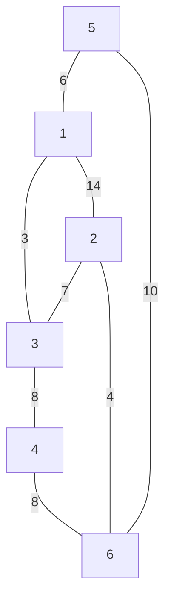
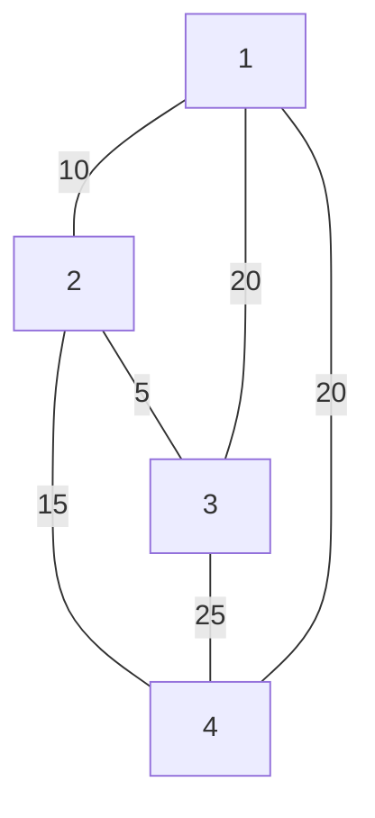

# A + B ภาคโหด
### input
บรรทัดแรก รับค่า a และ b
### output
บรรทัดเดียว จำนวนเต็มที่เกิดจาก a บวก b
### constraint:
0 <= a,b <= 10<sup>1000000</sup>

Time limit: 1 second

Memory limit: 16 MB

### input:
56 69

### output:
125

# เลขโรมัน
จงเขียนโปรแกรมเพื่อรับจำนวนเต็ม แล้วแสดงค่าออกมาเป็นเลขโรมัน โดยมีสัญลักษณ์ดังนี้ \
I 1 \
V 5 \
X 10 \
L 50 \
C 100 \
D 500 \
M 1000 \
การเขียนสัญลักษณ์ตัวน้อยกว่าไว้ด้านหลังหมายถึงให้บวกค่าเพิ่ม เช่น VIII (สามารถเขียนต่อท้ายได้ไม่เกิน 3 ตัว) ซึ่งมีค่าเท่ากับ 8 \
การเขียนสัญลักษณ์ตัวน้อยกว่าไว้ด้านหน้าหมายถึงให้ลดค่าลง เช่น IV ซึ่งมีค่าเท่ากับ 4 (ดูเพิ่มเติมตามตัวอย่าง input output)

### input
บรรทัดเดียว จำนวนเต็ม n
### output
บรรทัดเดียว เลขโรมัน

### Constraint:

n <= 3999

Time limit: 1 second

Memory limit: 16 MB

### input1:
49
### output1:
XLIX
### input2:
3879
### output2:
MMMDCCCLXXIX

# swap 2
ให้เลขมา n ตัวแล้วให้สลับตัวเลขจากซ้ายไปขวาเป็นขวาไปซ้าย โดยให้เลขคู่สลับกับเลขคู่ และเลขคี่สลับกับเลขคี่เท่านั้น
### input
บรรทัดแรก รับจำนวนเต็ม n 
### output
บรรทัดเดียว จำนวนเต็ม n ตัวที่สลับแล้ว แต่ละตัวขั้นด้วยช่องว่าง

### Constraint:

n <= 100000

Time limit: 1 second

Memory limit: 16 MB

### input:
10 \
1 3 4 2 6 5 7 9 8 0

### output:
9 7 0 8 6 5 3 1 2 4


# Sum 3 
จงหาผลรวมของตัวเลขตั้งแต่ 1 ถึง n
### input
บรรทัดแรก  รับจำนวนเต็ม n
### output
บรรทัดเดียว  จำนวนเต็มแสดงถึงผลรวมของตัวเลขตั้งแต่ 1 ถึง n


### Constraint:

n <= 1000000000
 
Time limit: 1 second

Memory limit: 16 MB

### input:
10

### output:
55

# Sum 4 
ให้เลขจำนวนเต็มมาทั้งหมด n ตัว โดยจะถามคุณทั้งหมด q ครั้ง ในแต่ละครั้งจะถามผลบวกตั้งแต่ตัวที่ l ถึง r 
### input
บรรทัดแรด จำนวนเต็ม n และ q แสดงถึง จำนวนตัวเลข และจำนวนคำถาม \
บรรทัดถัดมา มี n ตัว รับค่า $x_i$ (1 <= i <= n) \
บรรทัดที่ 3 จำนวเต็ม l และ r แสดงถึงตัวเริ่มต้น และ ตัวสุดท้าย (1 <= l,r <= n)
### output
มีทั้งหมด q บรรทัด ในแต่ละบรรทัดให้แสดงผลรวมตั้งแต่ตัวที่ l ถึง r

### Constraint:

1 <= n , q <= 1000000

for each 0 <= i < n 

-2147483648 <= $x_i$ <= 2147483647

1 <= l <= r <= n

Time limit: 1 second

Memory limit: 16 MB

### input:
10 2 \
11 5 8 3 16 4 2 10 12 7 \
1 7 \
2 5

### output:
49 \
32

# min max 2  
### input
บรรทัดแรก จำนวนเต็ม n \
บรรทัดถัดมา มี n จำนวน รับค่า $x_i$ (1 <= i <= n)
### output
บรรทัดแรก แสดงตัวเลขที่มีตัวซํ้ามากที่สุด ถ้ามีหลายตัวให้ทำการพิมพ์ค่าที่เจอก่อนตามลำดับ แต่ละตัวคั่นด้วยช่องว่าง \
บรรทัดถัดมา จำนวนที่เกิดการซํ้ากัน

### Constraint:

n <= 1000000

for each 0 <= i < n

0 <= $x_i$ <= 100000

Time limit: 1 second

Memory limit: 16 MB

### input:
10 \
1 4 8 32 2 3 4 8 4 8 

### output:
4 8 \
3

# sort 3 
### input
บรรทัดแรก จำนวนเต็ม n \
บรรทัดถัดมา มี n จำนวน รับค่า $x_i$ (1 <= i <= n)
### output
บรรทัดเดียว ถ้าเป็นเลขคู่ให้เรียงจากน้อยไปมาก ถ้าเป็นเลขคี่ให้เรียงจากมากไปน้อย

### Constraint:

n <= 100000

for each 0 <= i < n

0 <= $x_i$ <= 2147483647

Time limit: 1 second

Memory limit: 16 MB

### input:
10 \
1 7 12 23 2 3 1 5 8 0

### output:
23 7 0 5 2 3 1 1 8 12

# sort 4
### input
บรรทัดแรก จำนวเต็ม n \
n บรรทัดถัดมา จำนวนเต็มเป็นคู่
### output
มีทั้งหมด n บรรทัด โดยให้ค่าตัวหน้าเรียงจากน้อยไปมาก และถ้าตัวหน้าเท่ากันให้ตัวหลังเรียงจากมากไปน้อย

n <= 100,000

Time limit: 1 second

Memory limit: 16 MB

### input:
10 \
1 2 \
5 7 \
3 1 \
1 0 \
1 1 \
8 0 \
6 2 \
9 4 \
3 9 \
5 1

### output:
1 2 \
1 1 \
1 0 \
3 9 \
3 1 \
5 7 \
5 1 \
6 2 \
8 0 \
9 4 


# cola ข้าใครอย่าแตะ_ภาคโหด
วันหนึ่งนนซ่า007 ไปซื้อ cola ที่ร้านสะดวกซื้อซึ่งมี cola เหลืออยู่ n กระป๋อง แต่ที่ร้านดันขาย cola แต่ละกระป๋องในราคา $x_i$ บาท (ขายไม่เท่ากันซะงั้น) \
(1<=i<=n) เนื่องจากว่านนซ่า007 เป็นคนที่ชอบ cola เป็นอย่างมาก จึงอยากถามคุณทั้งหมด q ครั้ง ในแต่ละครั้ง หากนนซ่า007 มีเงินทั้งหมด $y_j$ บาท \
(1<=j<=q) จงหาว่าเขาจะสามารถซื้อ cola ได้มากที่สุดกี่กระป๋อง 
### input
บรรทัดแรก จำนวนเต็ม n และ q แสดงถึง จำนวน cola ที่เหลือ และ จำนวนคำถาม \
บรรทัดถัดมา มี n จำนวน รับค่า $x_i$ แสดงถึงราคา cola แต่ละกระป๋อง \
q บรรทัดถัดมา จำนวนเต็ม $y_j$ แสดงถึงจำนวนเงินที่นนซ่า007 มี
### output
q บรรทัด จำนวน cola ที่นนซ่า007 สามารถซื้อได้มากสุด

### Constraint:
1 <= n <= 500,000

1 <= $x_i$ <= 20,000

1 <= q <= 100

1 <= $y_i$ <= 2^63-1

Time limit: 1 second

Memory limit: 16 MB

### input:
7 2 \
10 20 12 15 15 14 9 \
50 \
60

### output:
4 \
5


# ร้านกาแฟ
มีร้านกาแฟร้านหนึ่งได้เก็บข้อมูลการเข้า-ออก ของลูกค้าภายภายในหนึ่งวันซึ่งมีทั้งหมด n คน โดยเก็บข้อมูลแต่ละคนแทนด้วยเลขสองตัว $u_i$ และ $v_i$ แสดงถึงเวลาเข้าร้านและเวลาที่ออกจากร้าน (1 <= i <= n) จงเขียนโปรแกรมเพื่อช่วยร้านกาแฟนี้คำนวณว่ามีคนเข้าร้านพร้อมกันมากที่สุดกี่คน \
<ins>หมายเหตุ</ins> ลูกค้าออกจากร้านเวลาไหน จะไม่นับว่าลูกค้าอยู่ในร้านเวลานั้น
### input
บรรทัดแรก จำนวนเต็ม n แสดงถึงจำนวนลูกค้าในวันนั้น \
n บรรทัดถัดมา จำนวนเต็มสองจำนวน $u_i$ และ $v_i$ แสดงถึงเวลาการเข้าร้าน และเวลาที่ออกจากร้านของคนที่ i 
### output
บรรทัดเดียว จำนวนลูกค้าที่เข้าร้านพร้อมกันมากที่สุด

### Constraint:
1 <= n <= 500,000

1 <= $u_i$ < $v_i$ <= 23

Time limit: 0.2 second

Memory limit: 256 MB

### input:
5 \
1 3 \
2 5 \
1 4 \
4 7 \
5 8 
### output:
3

# เรื่องของวงเล็บ
ให้สตริงที่ประกอบด้วยวงเล็บ "()" มาแล้วพิจารณาว่าเป็นวงเล็บสมดุลหรือไม่ ตัวอย่างวงเล็บที่สมดุล \
((()))()() \
(())()(((()())())) \
()()()((())) 

ตัวอย่างวงเล็บที่ไม่สมดุล \
(())) \
(()())())(()) 

<ins>คำสั่ง</ins> ถ้าสตริงที่ให้มาเป็นวงเล็บที่สมดุลให้พิมพ์คำว่า "Yesss" แต่ถ้าไม่สมดุลให้พิมพ์คำว่า "No!!"

### input
บรรทัดเดียว สตริงที่ประกอบไปด้วยวงเล็บ "()"
### output
บรรทัดเดียว พิมพ์คำว่า "Yesss" หรือ "No!!"

### Constraint:
Time limit: 1 second

Memory limit: 16 MB

### input1 :
(())()(((()())()))
### output1 :
Yesss

### input2 :
(()())())(()) 
### output2 :
No!!


# เรื่องของวงเล็บ 2
ให้สตริงที่ประกอบด้วยวงเล็บ "()", "{}", "[]" มาแล้วพิจารณาว่าเป็นวงเล็บสมดุลหรือไม่ ตัวอย่างวงเล็บที่สมดุล \
({[]}){{}} \
[()]{}[([]())] \
(){}[]{([])} 

ตัวอย่างวงเล็บที่ไม่สมดุล \
[()) \
{(()]}{}[] \
[{(}])[]{()} 

<ins>คำสั่ง</ins> ถ้าสตริงที่ให้มาเป็นวงเล็บที่สมดุลให้พิมพ์คำว่า "Yesss" แต่ถ้าไม่สมดุลให้พิมพ์คำว่า "No!!"

### input
บรรทัดเดียว สตริงที่ประกอบไปด้วยวงเล็บ "()", "{}", "[]"
### output
บรรทัดเดียว พิมพ์คำว่า "Yesss" หรือ "No!!"

### Constraint:
Time limit: 1 second

Memory limit: 16 MB

### input1 :
[()]{}[([]())] 
### output1 :
Yesss

### input2 :
{(()]}{}[]
### output2 :
No!!


# maximum contiguous sum
ให้เลขมา n ตัว ให้หาว่ามีผลรวมของตัวเลขที่ติดกันมากที่สุดเท่าใด
### input
บรรทัดแรก จำนวนเต็ม n 
บรรทัดถัดมา มี n ตัว รับค่า $x_i$ (1 <= i <= n)
### output
บรรทัดเดียว ผลรวมของตัวเลขที่ติดกันที่มากที่สุด

### Constraint:

1 <= n <= 5,000,000

-2,000 <= $x_i$ <= 2,000

Time limit: 1 second

Memory limit: 16 MB

### input:
10 \
1 -4 4 -9 2 5 -6 2 5 -3
### output :
8


# count_sequence
จงเขียนโปรแกรมรับลำดับตัวเลขเข้ามาทั้งหมด n ชุด ในแต่ละชุดจะมีลำดับตัวเลขอยู่ทั้งหมด m ตัว ให้เช็คว่ามีลำดับตัวเลขชุดใดที่มีการซํ้ามากที่สุด (รับประกันว่าจะมีเพียงชุดเดียว)
### input
บรรทัดแรก จำนวนเต็ม n \
n บรรทัดถัดมา มี m ตัวรับค่า $x_i$ (1 <= i <= m)
### output
บรรทัดแรก มี m ตัว แสดงลำดับตัวเลขที่มีการซํ้ามากที่สุด
บรรทัดถัดมา จำนวนที่เกิดการซํ้า

### Constraint:

3 <= n,m <= 10,000

-1,000 <= $x_i$ <= 1,000

Time limit: 1 second

Memory limit: 256 MB

### input:
3 6 \
1 2 3 4 5 6 \
2 3 4 5 6 7 \
1 2 3 4 5 6
### output :
1 2 3 4 5 6 \
2


# ตุล ตุ่ล ตุ้ล ตุ๊ล ตุ๋ล
วันหนึ่งตุลเบื่อจากการทำ TOI จึงไปหาของกินที่ตลาดแถวบ้าน ซึ่งที่ตลาดมีร้านเรียงเป็นเส้นตรงอยู่ทั้งหมด n ร้าน ในแต่ละร้านจะขายของในราคา $x_i$ บาท (1<= i <= n) 
ซึ่งสามารถติดลบได้ กล่าวคือร้านนั้นจะให้เงินตุลพร้อมกับของ เนื่องจากชื่นชอบในความโหดความอันตรายของเขา ในการซื้อของมีเงื่อนไขว่า ถ้าเขาเดินผ่านร้านใดต้องซื้อของจากร้านนั้น 
โดยเขาเริ่มเดินจากร้านที่ 1 ซึ่งถ้าเขามีเงินไม่พอซื้อของร้านใด เขาจะหยุดการซื้อของทันที และตุลต้องการความช่วยเหลือจากคุณโดยถามทั้งหมด q ครั้ง ว่าตุลสามารถเดินไปได้มากสุดกี่ร้านถ้าเขาพกเงินไป $k_j$ บาท (1 <= j <= q)
### input
บรรทัดแรก จำนวนเต็ม n และ q แสดงถึงจำนวนร้าน และจำนวนคำถาม \
บรรทัดถัดมา มี n จำนวน รับค่า $x_i$ แสดงถึงราคาสินค้าในร้านที่ i \
q บรรทัดถัดมา รับค่า $k_j$ แสดงถึงเงินที่เขาพกไป
### output
q บรรทัด จำนวนร้านที่เขาสามารถเดินไปได้สูงสุด

### Constraint:

1 <= n <= 500,000

1 <= q <= 100

-100 <= $x_i$ <= 100

0 <= $k_j$ <= INT_MAX

Time limit: 1 second

Memory limit: 16 MB

### input 1 :
5 2 \
25 20 10 15 10 \
50 \
77
### output 1 :
2 \
4

### input 2 :
5 3 \
25 -15 20 -20 10 \
30 \
25 \
10
### output 2 :
5 \
2 \
0


# prime number ภาคโหด
ให้ตัวเลขมาทั้งหมด n ตัว จงหาว่าต้องใช้ช่วงที่น้อยที่สุดเท่าใดจึงจะทำให้มีจำนวนเฉพาะ k ตัว
### input
บรรทัดแรก จำนวนเต็ม n และ k แสดงถึงจำนวนตัวเลข และ จำนวนของเลขจำนวนเฉพาะที่ต้องการ \
บรรทัดถัดมา จำนวนเต็ม n ตัว $x_i$ (1 <= i <= n)
### output
บรรทัดเดียว ช่องที่น้อยที่สุดที่ทำให้มีจำนวนเฉพาะ k ตัว

### Constraint:

1 <= k <= n <= 1,000,000

1 <= $x_i$ <= 1,000

Time limit: 1 second

Memory limit: 64 MB

### input 1 :
10 3\
1 2 3 4 5 6 7 8 9 10 
### output 1 :
4

### input 2 :
10 3\
1 6 2 3 8 8 7 4 5 10
### output 2 :
5

### input 3 :
15 4\
3 5 7 1 9 10 22 13 12 8 2 29 19 23 17
### output 3 :
4


# หาทางออก
วันหนึ่งคุณได้เผลอเดินเข้าไปที่บ้านร้างแห่งหนึ่ง ซึ่งบ้านหลังนี้มีลักษณะเป็นห้องๆ แบบตาราง n แถว m หลัก ซึ่งบางห้องจะมีผีอยู่แทนด้วยสัญลักษณ์ "X" แต่ถ้าห้องไหนไม่มีผีจะแทนด้วยสัญลักษณ์ "." ซึ่งตอนนี้คุณอยู่ที่ห้องซ้ายบนสุด เนื่องจากคุณอยากออกจากบ้านร้างนี้ให้เร็วที่สุด จงหาว่าต้องเดินผ่านห้องน้อยที่สุดเท่าใดที่จะไปถึงห้องขวาล่างได้(ทางออก) โดยมีเงื่อนไขคือสามารถไปได้แค่ห้องที่ติดกัน (บน,ล่าง,ซ้าย,ขวา) ห้ามไปห้องที่มีผีอยู่ และ เมื่อเดินผ่านห้องไหนมาแล้วจะไม่สามารถกลับไปห้องนั้นได้อีก(ประตูนั้นจะล็อคโดยอัตโนมัติ) (รับประกันว่าจะสามารถไปถึงทางออกได้เสมอ)
### input
บรรทัดแรก จำนวนเต็ม n และ m แสดงถึงขนาดของบ้าน \
n บรรทัดถัดมา ประกอบด้วยสัญลักษณ์ "X" หรือ "." แสดงถึงห้องที่มีผี และ ห้องที่ไม่มีผี
### output
บรรทัดเดียว จำนวนห้องที่ต้องผ่านน้อยที่สุดในการไปถึงทางออก

### Constraint:

3 <= n,m <= 100

Time limit: 1 second

Memory limit: 64 MB

### input 1 :
```
3 3 
.XX 
... 
XX.
```
### output 1 :
5
### input 2 :
```
4 5 
.X... 
...X. 
.XXX. 
.....
```
### output 2 :
8


# shortest path
มีเมืองอยู่ทั้งหมด n เมือง มีถนนอยู่ทั้งหมด m เส้น แต่ละเส้นเชื่อมจากเมือง u ไปเมือง v ด้วยระยะทาง w สามารถไปกลับหากันได้ จงหาเส้นทางที่สั้นที่สุดจากเมือง s ไปเมือง t
### input
บรรทัดแรก จำนวนเต็ม n m s และ t แสดงถึงจำนวนเมือง จำนวนถนน เมืองเริ่มต้น และเมืองเป้าหมาย \
m บรรทัดถัดมา รับค่า u v และ w แสดงถึงเส้นทางจากเมือง u ไป v ด้วยระยะทาง w
### output
บรรทัดเดียว เส้นทางที่สั้นที่สุดจากเมือง s ไปเมือง t

### Constraint:

1 <= n,m <= 200,000

1 <= s,t <= n

1 <= w <= 1,000

Time limit: 1 second

Memory limit: 64 MB

### input 1 :
6 8 1 6 \
1 3 3 \
1 2 14 \
2 3 7 \
5 1 6 \
2 6 4 \
5 6 10 \
3 4 8 \
4 6 8

### output 1 :
14

<br>
จากตัวอย่างจะได้รูปร่างดังนี้




# shortest path 2
มีเมืองอยู่ทั้งหมด n เมือง มีถนนอยู่ทั้งหมด m เส้น แต่ละเส้นเชื่อมจากเมือง u ไปเมือง v ด้วยระยะทาง w สามารถไปกลับหากันได้ จงเขียนโปรแกรมเพื่อหาเส้นทางที่สั้นที่สุดจากเมือง s ไปเมือง t
พร้อมกับบอกด้วยว่าในเส้นทางนั้นเดินผ่านเมืองไหนบ้าง
### input
บรรทัดแรก จำนวนเต็ม n m s และ t แสดงถึงจำนวนเมือง จำนวนถนน เมืองเริ่มต้น และเมืองเป้าหมาย \
m บรรทัดถัดมา รับค่า u v และ w แสดงถึงเส้นทางจากเมือง u ไป v ด้วยระยะทาง w
### output
บรรทัดแรก เส้นทางที่สั้นที่สุดจากเมือง s ไปเมือง t
บรรทัดถัดมา เมืองที่เดินผ่านในเส้นทางที่สั้นที่สุด
บรรทัดที่ 3 จำนวนถนนที่เดินผ่าน

### Constraint:

1 <= n,m <= 200,000

1 <= s,t <= n

1 <= w <= 1,000

Time limit: 1 second

Memory limit: 64 MB

### input 1 :
6 8 1 6 \
1 3 3 \
1 2 14 \
2 3 7 \
5 1 6 \
2 6 4 \
5 6 10 \
3 4 8 \
4 6 8

### output 1 :
14 \
1 3 2 6 \
3

<br>
จากตัวอย่างจะได้รูปร่างดังนี้


# minimum spanning tree
มีเมืองอยู่ทั้งหมด n เมือง มีถนนอยู่ทั้งหมด m เส้น แต่ละเส้นเชื่อมจากเมือง u ไปเมือง v ด้วยระยะทาง w สามารถไปกลับหากันได้ จงเขียนโปรแกรมเพื่อหาผลรวมระยะทางที่น้อยที่สุดที่ทำให้สามารถเดินทางไปยังทุกเมืองได้
### input
บรรทัดแรก จำนวนเต็ม n และ m แสดงถึงจำนวนเมือง และจำนวนเส้นทาง \
m บรรทัดถัดมา จำนวนเต็ม u v และ w แสดงเส้านทางที่เชื่อมจากเมือง u ไปเมือง v ด้วยระยะทาง w
### output
บรรทัดเดียว ผลรวมระยะทางที่น้อยที่สุดที่ทำให้สามารถไปถึงทุกเมืองได้

### Constraint:

1 <= n,m <= 100,000

1 <= w <= 100,000

Time limit: 1 second

Memory limit: 64 MB

### input :
4 6 \
1 2 10 \
1 3 20 \
2 4 15 \
3 4 25 \
1 4 20 \
2 3 5 
### output :
30

<br>
จากตัวอย่าง




